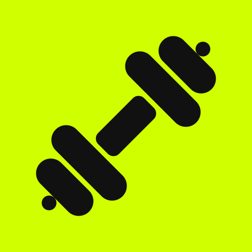

  
  <h1>Gym Tracker</h1>
  
<strong>Manual de Usuario y Documentación Funcional</strong>

---

## 1. Introducción
**Gym Tracker** es una aplicación web progresiva (PWA) diseñada para ayudar tanto a deportistas como a entrenadores personales a gestionar entrenamientos, planificar rutinas y hacer un seguimiento exhaustivo del progreso de fuerza.

La aplicación opera bajo un ecosistema de dos roles principales: **Alumno** y **Profesor**. Ambos comparten la misma base de datos, lo que permite que el trabajo de planificación que realiza el entrenador se sincronice instantáneamente en el dispositivo del deportista.

---

## 2. Tipos de Usuario y Roles

### 👨‍🎓 Rol: Alumno
El perfil de Alumno está pensado para registrar el día a día en el gimnasio.
- **Inicio de Sesión / Registro:** Puede crear una cuenta usando correo electrónico o Google.
- **Vinculación con Entrenador:** Durante la configuración del perfil, el Alumno tiene la opción de ingresar un **Código de Profesor**. Si lo hace, su entrenador tendrá acceso a sus estadísticas y podrá enviarle rutinas directamente.
- **Objetivo Semanal:** Define cuántos días a la semana desea entrenar para mantener la motivación.

### 👨‍🏫 Rol: Profesor (Entrenador)
El perfil de Profesor está diseñado para la gestión y seguimiento.
- **Código de Profesor:** El ID de cuenta del Profesor funciona como un código único. Los alumnos deben ingresar este código al crear sus cuentas para quedar vinculados.
- **Herramientas Centralizadas:** El profesor tiene su propia biblioteca independiente de ejercicios y plantillas de rutinas que no afectan su historial personal (ya que el profesor supervisa, pero sus datos se mantienen separados de los alumnos).

---

## 3. Funcionalidades del Alumno (Paso a Paso)

### 🏋️ Entrenar (Modo Libre o por Rutina)
- El alumno puede iniciar un **Entrenamiento Libre** eligiendo un grupo muscular, o iniciar una **Rutina** (un conjunto predefinido de ejercicios).
- Durante el entrenamiento, la app asiste al usuario mostrando el peso máximo que logró en la sesión anterior para cada ejercicio.
- Al guardar la sesión, el volumen y los pesos se envían a las Estadísticas.

### 📁 Pestaña "Rutinas"
- **Crear Rutina:** El alumno puede armar sus propias rutinas seleccionando los días de la semana y los ejercicios deseados.
- **Rutinas Asignadas:** Si el Profesor le asigna una rutina, esta aparecerá automáticamente en esta pestaña (con una etiqueta verde indicando "ASIGNADA POR TI" en la vista del profesor, y disponible para iniciar en la del alumno).

### ➕ Pestaña "Ejercicios"
- Contiene un listado de ejercicios base (categorizados por grupo muscular: Piernas, Pecho, Espalda, etc.).
- El alumno puede **Crear sus propios ejercicios** (ej. "Remo en Máquina Específica").

### 📈 Pestaña "Estadísticas" e "Historial"
- **Evolución:** Muestra gráficas del progreso de fuerza. Solo se muestran los ejercicios que han tenido un incremento de peso a lo largo del tiempo, facilitando ver dónde hay sobrecarga progresiva real.
- **Consistencia:** Un anillo de progreso semanal basado en el objetivo de días de entrenamiento.

---

## 4. Funcionalidades del Profesor (Paso a Paso)

El panel del Profesor es una herramienta de mando. Al iniciar sesión, la vista inferior/lateral cambia a un modo de gestión profesional.

### 👥 Pestaña "Alumnos" (Panel Principal)
1. **Ver Alumnos:** A la izquierda (o deslizando) aparecerá la lista de todos los alumnos que hayan introducido tu código de profesor.
2. **Revisar Progreso:** Al tocar a un alumno, verás exactamente lo que él ve en su pestaña de Estadísticas. Podrás analizar su evolución, volumen de entrenamiento y consistencia.
3. **Auditar Rutinas:** Podrás ver qué rutinas tiene activas actualmente el alumno.
4. **Asignar Rutina:** Mediante un botón destacado, puedes enviar un plan de entrenamiento al alumno.
   - Puedes crear una rutina **Desde cero**.
   - O puedes seleccionar **"Copiar de Mis Plantillas"** para ahorrar tiempo.

### 📋 Pestaña "Plantillas"
- Esta es tu biblioteca de rutinas base.
- **Paso a paso:** Toca "Crear Rutina" y ponle un nombre (ej. "Día 1: Hipertrofia Pecho/Tríceps"). Selecciona los ejercicios. Esta plantilla quedará guardada solo para ti, lista para ser disparada a cualquier alumno desde la pestaña "Alumnos".

### 🔧 Pestaña "Mis Ejercicios"
- Como profesor, puedes crear ejercicios sumamente específicos o con nomenclatura propia que no están en la lista base de la app (ej. "Sentadilla Búlgara c/ Mancuerna Tempo 3-1-1").
- **Dato clave:** Los ejercicios que tú des de alta aquí **estarán disponibles** para ser usados en las plantillas. Cuando asignes una plantilla que contenga tus ejercicios personalizados a un alumno, la aplicación automáticamente le dará permiso al alumno para ver ese ejercicio y registrar sus pesos.

---

## 5. Resumen del Flujo de Trabajo Ideal (Entrenador)
1. Inicias sesión en **Gym Tracker** y defines tu rol como **Profesor**.
2. Compartes tu ID/Código de Profesor a tus clientes.
3. Vas a **Mis Ejercicios** y das de alta cualquier movimiento específico que uses en tus metodologías.
4. Vas a **Plantillas** y armas tus rutinas (ej. Fase 1: Adaptación Anatómica, Fase 2: Fuerza Máxima).
5. Cuando un cliente se registra y usa tu código, aparecerá en tu pestaña **Alumnos**.
6. Seleccionas al cliente, tocas **Asignar Rutina**, y le envías las plantillas correspondientes.
7. Semana a semana, entras al perfil del cliente para revisar la pestaña de **Estadísticas**, observando sus incrementos de carga para ajustar la siguiente fase de su entrenamiento.
